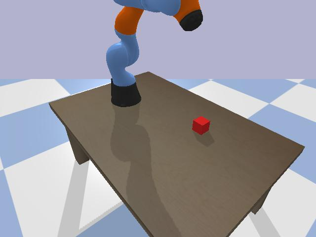
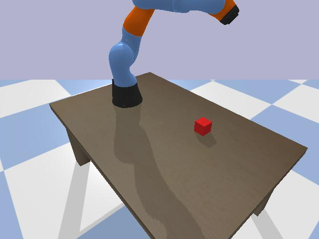
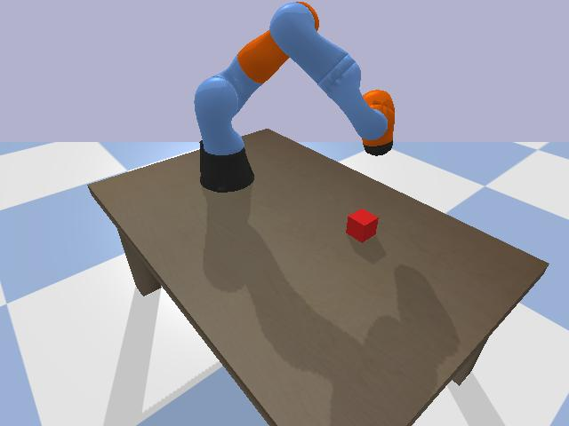
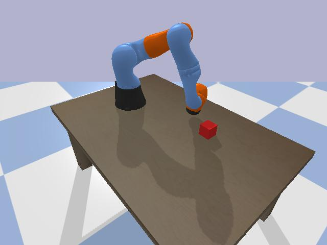

# Zero-Shot Vision-Driven Robotics Simulation

[](https://www.python.org/)
[](https://pybullet.org/)
[](LICENSE)

An end-to-end, vision-guided robotics manipulation pipeline combining **PyBullet** physics with multimodal **Vision-Language Models (VLMs)**. 

The autonomous agent makes physical decisions based **strictly on raw RGB visual observations** captured by a synthetic virtual camera—operating without privileged state information (such as ground-truth world-frame simulator coordinates or bounding boxes).

---

## 📸 Perception-Action Trajectory

The model visualizes the workspace, extracts spatial context, and drives the 7-DOF manipulator directly to the target object:

| Step 1: Perception & Alignment | Step 2: Approach Corridor Extension |
| :---: | :---: |
|  |  |
| **Observation**: Red cube detected on tabletop.<br>**Action**: Elevating elbow, aligning base yaw. | **Observation**: Base oriented with block.<br>**Action**: Extending forearm into approach vector. |

| Step 3: Descending Toward Object | Step 4: Visual Target Acquisition |
| :---: | :---: |
|  |  |
| **Observation**: Manipulator centered over workspace.<br>**Action**: Descending end-effector toward target. | **Observation**: Goal configuration achieved.<br>**Action**: Holding hover pose directly above cube. |

---

## 🏗️ System Architecture

```
┌────────────────────────────────────────────────────────┐
│                   PyBullet Physics                     │
│  - Tabletop Workspace (Table URDF)                     │
│  - 7-DOF Robotic Arm (KUKA LBR iiwa)                   │
│  - Target Object (Vibrant Red Cube)                    │
└──────────────────────────┬─────────────────────────────┘
                           │ 1. Pause Physics & Render
                           ▼
┌────────────────────────────────────────────────────────┐
│                  Synthetic Camera                      │
│  - View Matrix: `computeViewMatrixFromYawPitchRoll`    │
│  - Projection: `computeProjectionMatrixFOV`            │
│  - Formats: uint8 NumPy (H, W, 3) ➔ PIL ➔ Base64 JPEG   │
└──────────────────────────┬─────────────────────────────┘
                           │ 2. Multimodal API Payload
                           ▼
┌────────────────────────────────────────────────────────┐
│             Vision-Language Model (VLM)                │
│  - Zero-shot spatial perception from RGB frame         │
│  - Enforces Structured JSON Output via Pydantic:       │
│    { reasoning, target_joint_angles, is_terminal }     │
└──────────────────────────┬─────────────────────────────┘
                           │ 3. Dispatch Joint Targets
                           ▼
┌────────────────────────────────────────────────────────┐
│               Synchronous Physics Stepping             │
│  - Motor Control: `setJointMotorControlArray`          │
│  - Deterministic step window (120 ticks @ 240 Hz)      │
│  - Eliminates perception-action latency                │
└────────────────────────────────────────────────────────┘
```

---

## 🧠 Overcoming Perception-Action Latency

In continuous simulation loops, asynchronous external API queries incur between **200ms and 800ms of latency**. If physics continues stepping during inference, the robot reacts to stale observations, resulting in violent oscillations, joint overshoot, or physics instability.

### Synchronous Turn-Based Execution
This framework decouples deliberation time from physical time:
1. **Freeze**: Simulation physics remains paused while the synthetic camera frame is extracted and transmitted.
2. **Infer**: The multimodal model deliberates and produces target joint angles.
3. **Advance**: Motor position controllers are updated, and the simulation advances synchronously for an exact physical window ($\Delta t = 120 \text{ ticks} \times \frac{1}{240}\text{s} = 0.5\text{s}$) to allow joint settling before capturing the next observation.

---

## 📐 Virtual Synthetic Camera Formulation

The camera pose is parameterized with spherical coordinates relative to the workspace target:

$$
\mathbf{p}_{\text{target}} = \begin{bmatrix} 0.0 & 0.0 & 0.65 \end{bmatrix}^T, \quad d = 1.4\text{m}, \quad \text{yaw} = 50^\circ, \quad \text{pitch} = -35^\circ
$$

PyBullet computes the view matrix $\mathbf{V}$ and perspective projection matrix $\mathbf{P}$:
```python
view_matrix = p.computeViewMatrixFromYawPitchRoll(
    cameraTargetPosition=[0.0, 0.0, 0.65],
    distance=1.4,
    yaw=50.0,
    pitch=-35.0,
    roll=0.0,
    upAxisIndex=2,  # Z-axis is UP
)

proj_matrix = p.computeProjectionMatrixFOV(
    fov=60.0,
    aspect=640.0 / 480.0,
    nearVal=0.1,
    farVal=3.5,
)
```

The raw OpenGL buffer is extracted and normalized into standard formats:
```python
# Extract RGBA buffer and reshape
_, _, rgb_raw, _, _ = p.getCameraImage(
    width=640,
    height=480,
    viewMatrix=view_matrix,
    projectionMatrix=proj_matrix,
    renderer=p.ER_BULLET_HARDWARE_OPENGL,
    flags=p.ER_NO_SEGMENTATION_MASK,
)

rgba_array = np.reshape(rgb_raw, (480, 640, 4)).astype(np.uint8)
rgb_array = rgba_array[:, :, :3]  # Strip alpha
```

---

## 📦 Directory Layout

```
zero-shot-vision-robotics/
├── assets/
│   └── images/                   # Captured trajectory frames
│       ├── step_01.jpg
│       ├── step_02.jpg
│       ├── step_03.jpg
│       └── step_04.jpg
├── vision_robotics/              # Core Simulation Package
│   ├── __init__.py
│   ├── agent.py                  # VLM action schema & policy connectors
│   ├── camera.py                 # Synthetic camera matrix calculation & RGB capture
│   ├── config.py                 # Simulation, camera, and robot dataclasses
│   └── environment.py            # Tabletop scene setup & PyBullet joint controllers
├── .env.example                  # Safe template for API keys
├── .gitignore                    # Prevents leaking .env, tokens, and caches
├── main.py                       # Executable perception-action loop
├── requirements.txt              # Production dependencies
└── test_simulation.py            # Unit test suite
```

---

## ⚡ Quickstart

### 1. Clone & Install Dependencies
```bash
git clone https://github.com/opaielsheikh/zero-shot-vision-robotics.git
cd zero-shot-vision-robotics
python3 -m venv .venv
source .venv/bin/activate
pip install -r requirements.txt
```

### 2. Run Interactive 3D Simulation
To launch the 3D PyBullet visualizer with real-time physics:
```bash
python main.py
```

### 3. Run Headless Mode
For headless environments, Docker containers, or CI:
```bash
python main.py --headless --steps 4 --output-dir captured_frames
```

### 4. Run Test Suite
```bash
python test_simulation.py
```

---

## 🔌 Connecting Live Multimodal APIs

The agent architecture uses a Pydantic schema enforcing structured JSON output:

```python
class VLMAction(BaseModel):
    reasoning: str
    target_joint_angles: List[float]
    gripper_closed: bool = False
    task_completed: bool = False
```

### Google Gemini (Gemini 2.5 Flash / Pro)
Copy `.env.example` to `.env` and set your key:
```bash
cp .env.example .env
```

In `main.py`:
```python
from vision_robotics import VisionLanguageAgent
import os

agent = VisionLanguageAgent(
    num_dofs=env.num_dofs,
    mode="gemini",
    api_key=os.environ.get("GEMINI_API_KEY"),
    model_name="gemini-2.5-flash",
)
```

### Custom OpenAI / Anthropic / Local Vision Models
Any model that accepts image parts and conforms to the `VLMAction` JSON schema can be plugged into `vision_robotics/agent.py` by implementing `predict_action`.

---

## 🛡️ Security Note
Your private API keys (stored in `.env`) are **strictly ignored** by `.gitignore` and are never committed or pushed to GitHub. Always use `.env.example` as a public template.

---

## 📜 License
MIT License. Feel free to use and extend for academic, research, and robotics development.
